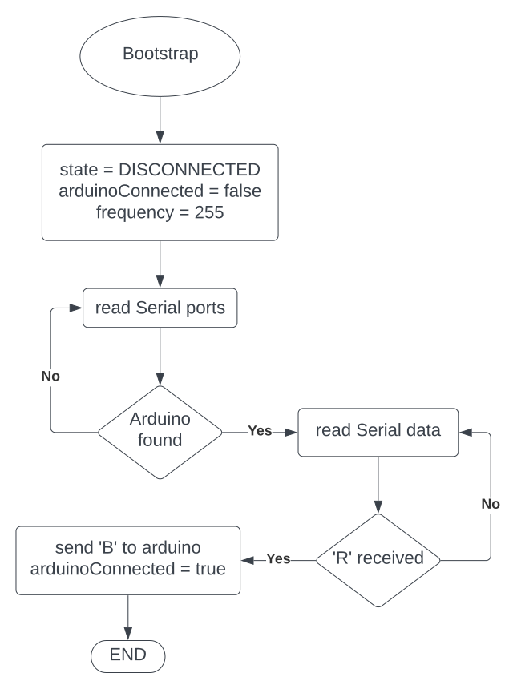

# Ground Station

QtQuick desktop app of the ground station + Arduino code of the LoRa 

## Contribute

### QtQuick application

Via the Qt Maintenanced Tool, install the following dependecies:
- Qt 6.4.3
- QtQuick 
- QtCharts
- QtSerialPort

Then set up your environement:
 1. Clone the repository
 2. Qt Creator > File > Open File or Project
 3. Browse to the CMakeList.txt file
 4. Select the development kit (should be Qt 6.4.3)

### Arduino code

1. Install and open the Arduino IDE
2. Install the library "LoRa_E220"
3. File > Open > `./arduino/main/main.ino`

## Messages

### Rocket board &mdash; Ground-Station

These messages are sent via radio from the rocket to the ground station (&darr;), viceversa (&uarr;) or in both directions (&varr;). All the messages received via radio by the ground-station board are then forwarded to the application via Serial communication. In the case of received `[C]`, the board always repeats back a `[C]` to the rocket;

| code | name | load type | payload description | direction |
| :--: | ---- | :--: | ----------- | :-: |
| C | COM check | - | - | &varr; |
| E | Error | 1 byte | which error occured (see [error codes](#errors-codes)) (**not yet implemented**) | &darr; |
| D | Data | 9 float | pressures, temperature, linear acceleration, gyroscope | &darr; |
| P | Parachute opened | 1 byte | 1 for drogue, 2 for main (**not yet implemented**) | &darr; |
| F | Frequency change | 1 byte | 0 to 81 (see [LoRa library](https://github.com/xreef/EByte_LoRa_E220_Series_Library#basic-configuration-option)) | &uarr; |

### Internal (serial) messages

To denote the start of a message from the board to the application, a `~` charachter is prepended to the message itself; the size of the payload is then inferred based on the code. In addition to the previous messages, two new ones are used for internal communications (&uarr; = from app to board, &darr; = viceversa):

| code | name | payload | direction |
| :--: | ---- | :-----: | :-------: |
| G | Internal COM check | &ndash; | &varr; | 
| L | Local frequency change | 1 byte: 0 to 81 (see [LoRa library](https://github.com/xreef/EByte_LoRa_E220_Series_Library#basic-configuration-option)) | &uarr; |
| R | Frequency rollback | &ndash; | &darr; |

The local frequency change issues only the change of frequency of the GS LoRa, and does not initiate the whole procedure of frequency change (which is done using the `F` message).

The `R` message is sent when the (complete) frequency change procedure has failed, i.e. no message was received from the rocket at the new frequency.

### Errors codes

| number | description |
| :----: | ----------- |
| 1 | IMU not working |
| 2 | Barometer not working |
| 3 | GPS not working |

<!-- 
## Flow charts

### Bootstrap

### setFrequency

-->

## Release

### Windows

Following the [official guide](https://doc.qt.io/qt-6/windows-deployment.html):

1. Switch to "Release" build type and build the project
2. Copy the generated `/path/to/release/build/folder/appground-station.exe` file into a new folder 
3. Open the cmd in the `bin` directory inside the Qt directory in your local machine (usually `C:/Qt/<version>/<compiler>/`)
4. Run `windeployqt /path/to/the/executable/you/copied.exe --qmldir /path/to/release/build/folder/ground-station`  

#### Other way 

THIS TUTORIAL IS FOR WINDOWS USERS

Needed tools : perl, cmake, git, VisualStudio (all of theses should be added to your path)

we will start by downloading the git qt project 

`$ git clone git://code.qt.io/qt/qt5.git qt6`

`$ cd qt6`

`$ git switch 6.4.3`

now we can leave the git bash and open a normal cmd with admin rights, we type:

` $ perl init-repository  --module-subset=qtbase,qtshadertools,qtdeclarative,qtcharts,qtserialport `

Now go to the parent folder of qt6 (for ex, if qt6's adress is C:\User\Docments\QT\qt6 go to C:\User\Docments\QT using cd C:\User\Docments\QT) then do :

`$ mkdir qt6-build`

`$ cd qt6-build`

`$ configure.bat -static -release -opensource -confirm-license  -prefix <path/to/install> `

`$ cmake --build . `

`$ cmake --install . `

replace <path/to/install>  with the directory in which you want to install Qt, I advice you to create a Qt directory such as C:\Qt

As fast as you do that add the following entry to your environment variable:
Variable : CMAKE_PREFIX_PATH (NOT PATH)
Value : where you installed QT (in my example C:\QT)

Congrats, you statically built QT. Now we will build the actual project

create a new directory where we will build the project, there open a x64 Native Tools Command Prompt. then you throw the following 2 commands :

`cmake ../path/to/ground-station -G "Visual Studio 16 2019" -DCMAKE_BUILD_TYPE=Release `

`msbuild /m /p:Configuration=Release ground-station.sln` 

(check that msbuild is already on path, if you do not have VS2019 replace it with the version you have, replace ../path/to/ground-station with the actual path to the ground-station source files)

At the end of the operation the cmd will display "BUILD FAILED" => THAT ISN'T TRUE

check for the Release directory in your project and run the exe + share it if needed

guide based on : https://wiki.qt.io/Building_Qt_6_from_Git

