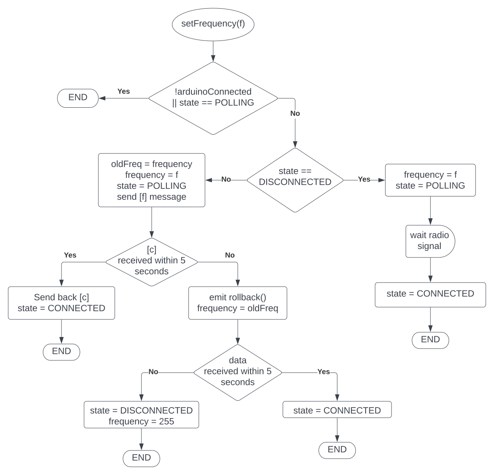

# Ground Station

QtQuick desktop app of the ground station + Arduino code of the LoRa 

## Contribute

### QtQuick application

Via the Qt Maintenanced Tool, install the following dependecies:
- Qt 6.4.3
- QtQuick 
- QtCharts
- QtSerialPort

Then set up your environement:
 1. Clone the repository
 2. Qt Creator > File > Open File or Project
 3. Browse to the CMakeList.txt file
 4. Select the development kit (should be Qt 6.4.3)

### Arduino code

1. Install and open the Arduino IDE
2. Install the library "LoRa_E220"
3. File > Open > `./arduino/main/main.ino`

## Messages

### Rocket board &mdash; Ground-Station

These messages are sent via radio from the rocket to the ground station (&darr;), viceversa (&uarr;) or in both directions (&varr;). All the messages received via radio by the ground-station board are then forwarded to the application via Serial communication. In the case of received `[C]`, the board always repeats back a `[C]` to the rocket;

| code | name | load type | payload description | direction |
| :--: | ---- | :--: | ----------- | :-: |
| C | COM check | - | - | &varr; |
| E | Error | 1 byte | which error occured (see [error codes](#errors-codes)) (**not yet implemented**) | &darr; |
| D | Data | 9 float | pressures, temperature, linear acceleration, gyroscope | &darr; |
| P | Parachute opened | 1 byte | 1 for drogue, 2 for main (**not yet implemented**) | &darr; |
| F | Frequency change | 1 byte | 0 to 81 (see [LoRa library](https://github.com/xreef/EByte_LoRa_E220_Series_Library#basic-configuration-option)) | &uarr; |

### Internal (serial) messages

To denote the start of a message from the board to the application, a `~` charachter is prepended to the message itself; the size of the payload is then inferred based on the code. In addition to the previous messages, two new ones are used for internal communications (&uarr; = from app to board, &darr; = viceversa):

| code | name | payload | direction |
| :--: | ---- | :-----: | :-------: |
| G | Internal COM check | &ndash; | &varr; | 
| L | Local frequency change | 1 byte: 0 to 81 (see [LoRa library](https://github.com/xreef/EByte_LoRa_E220_Series_Library#basic-configuration-option)) | &uarr; |
| R | Frequency rollback | &ndash; | &darr; |

The local frequency change issues only the change of frequency of the GS LoRa, and does not initiate the whole procedure of frequency change (which is done using the `F` message).

The `R` message is sent when the (complete) frequency change procedure has failed, i.e. no message was received from the rocket at the new frequency.

### Errors codes

| number | description |
| :----: | ----------- |
| 1 | IMU not working |
| 2 | Barometer not working |
| 3 | GPS not working |

<!-- 
## Flow charts

### Bootstrap


### setFrequency


-->

## Build for release

> NOTE: the following guide is for __windows only__

### Deployable folder

The Windows deployment tool `windeployqt` is designed to automate the process of creating a deployable folder containing the Qt-related dependencies (libraries, QML imports, plugins, and translations) required to run the application from that folder.
Following the [official guide](https://doc.qt.io/qt-6/windows-deployment.html#the-windows-deployment-tool):

1. Switch to "Release" build type and build the project
2. Copy the generated `/path/to/release/build/folder/appground-station.exe` file into a new folder 
3. Open the cmd in the `bin` directory inside the Qt directory in your local machine (usually `C:/Qt/<version>/<compiler>/`)
4. Run `windeployqt /path/to/the/executable/you/copied.exe --qmldir /path/to/release/build/folder/ground-station`  

> NOTE: the deployable folder for some reason does not include some Qt dlls required to run the application. The person you are giving this folder to still needs to provide those dlls.

### Static executable 

It is possible to build statically the application and produce a single executable. You will need the following tools installed on your machine and present in the `PATH` variable:

- CMake & git (already needed for development)
- [MSVC](https://visualstudio.microsoft.com/vs/features/cplusplus/) (Microsoft Visual C++) compiler
- [Perl](https://www.perl.org/get.html)

Before building our application, you first need to statically buil Qt. Open a command prompt with admin rigth and perform the following:

> Here we use `C:\Qt` as installation folder of Qt, but actually you can use whatever folder you like: make sure it already exists

```bash
#  Download the git Qt project
git clone git://code.qt.io/qt/qt5.git qt6
cd qt6
git switch 6.4.3

# init the repository with the qt modules used
perl init-repository --module-subset=qtbase,qtshadertools,qtdeclarative,qtcharts,qtserialport

# create the build directory
cd ..
mkdir qt6-build
cd qt6-build

# configure and build
..\qt6\configure.bat -static -release -opensource -confirm-license -prefix C:\Qt
cmake --build .
cmake --install .
```

Now add `CMAKE_PREFIX_PATH` to your environment variables (__not__ to the `PATH` variable) with the value `C:\Qt` (or whatever folder you chose for the installation folder of Qt). If you have other cmake projects, you can remove/restore this variable after completing the build of the application.

Finally, create the folder where you want to build the ground-station project, open the Native Tools Command Prompt (it is part of Visual Studio and can be found using the windows search bar) and run the following commands:

```bash 
cd <newly\created\ground-station\build\folder>
cmake <path\to\ground-station\source\folder> -G "Visual Studio 17 2022" -DCMAKE_BUILD_TYPE=Release 
msbuild /m /p:Configuration=Release ground-station.sln
```

If you have older versions of VS2022, replace the string with the version you have (e.g. `"Visual Studio 16 2019"`). At the end of the operation the message `BUILD FAILED` will be displayed, but that is __not__ true. You should now have an executable inside your build folder.

> Guide based on : https://wiki.qt.io/Building_Qt_6_from_Git
